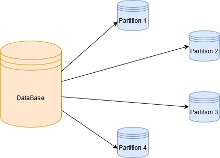

# Home Sales Analysis with PySpark

This project analyzes a dataset of home sales using PySpark and SparkSQL. The analysis explores key metrics such as average home prices based on various criteria, caching performance, and data partitioning.

## Project Objective
The objective is to analyze the home sales data to extract insights using PySpark, perform efficient queries using caching, and optimize storage and querying by partitioning the data.

## Dataset
The dataset used in this project is `home_sales_revised.csv`, which contains information about home sales, including the following fields:
- `id`: Unique identifier for the home sale
- `date`: Sale date
- `price`: Sale price of the home
- `bedrooms`: Number of bedrooms
- `bathrooms`: Number of bathrooms
- `sqft_living`: Square footage of the living space
- `sqft_lot`: Lot size in square feet
- `floors`: Number of floors
- `waterfront`: Waterfront property indicator
- `view`: View rating of the home
- `date_built`: Year the home was built

## Steps and Implementation

### 1. Import PySpark and Read the Dataset
- PySpark is used to read the CSV dataset into a Spark DataFrame.
- A temporary table `home_sales` is created for SQL-based querying.

### 2. Query: Average Price for Four-Bedroom Houses Sold Per Year
- A SparkSQL query calculates the average price of four-bedroom houses sold for each year, rounded to two decimal places.

### 3. Query: Average Price for Homes with Three Bedrooms and Bathrooms Per Year Built
- Homes with exactly three bedrooms and three bathrooms are filtered, and their average price is calculated for each year built.

### 4. Query: Average Price for Homes with Specific Features Per Year Built
- Filters are applied to homes with:
  - 3 bedrooms
  - 3 bathrooms
  - 2 floors
  - Square footage ≥ 2000
- The average price is calculated for each year built.

### 5. Query: Average Price by View Rating for Homes Priced Over $350,000
- The query calculates the average price of homes per "view" rating where the average price is ≥ $350,000.
- Runtime for the query is recorded.

### 6. Caching and Performance Comparison
- The `home_sales` table is cached using PySpark.
- The query for average price by view rating is rerun on the cached table.
- Performance is compared to the uncached query runtime.

### 7. Data Partitioning by `date_built`
- The dataset is partitioned by `date_built` and stored in Parquet format.
- The partitioned data is read back into a DataFrame.

### 8. Temporary Table for Parquet Data
- A temporary table is created from the partitioned Parquet data.
- Queries are executed on the Parquet table, and runtime is compared to previous executions.

### 9. Uncaching Temporary Table
- The cached table `home_sales` is uncached, and its status is verified.

## Requirements
The project meets the following criteria:
- A Spark DataFrame is created from the dataset.
- Temporary tables are created for both CSV and Parquet data.
- Queries for specific metrics are implemented and optimized.
- Caching and uncaching functionality is verified.
- The dataset is partitioned and stored in Parquet format.

## Runtime Analysis
- The runtime for queries using uncached data, cached data, and partitioned data is recorded for performance comparison.

## Setup Instructions
1. Install the required libraries and dependencies:
   - PySpark
   - findspark
2. Download the dataset `home_sales_revised.csv` from the provided link.
3. Execute the notebook to replicate the analysis.

## Conclusion
The analysis demonstrates how PySpark can be used to handle large datasets efficiently, optimize queries with caching, and organize data with partitioning.

## Repository Structure
- `Home_Sales.ipynb`: Jupyter Notebook containing the full analysis and implementation.
- `home_sales_revised.csv`: Dataset used for the analysis.

